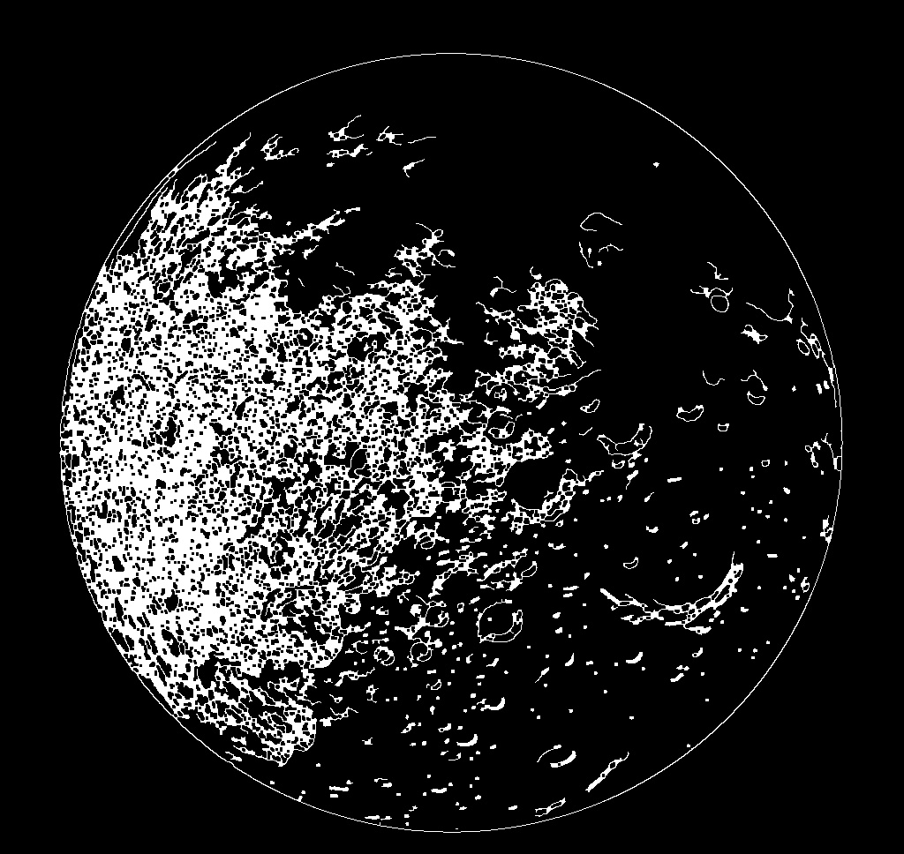
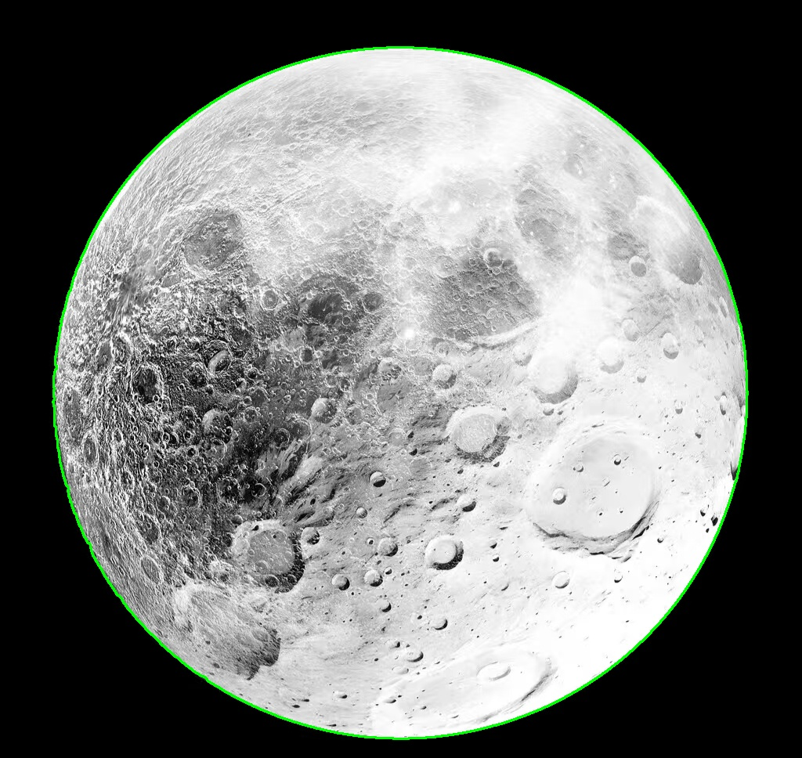
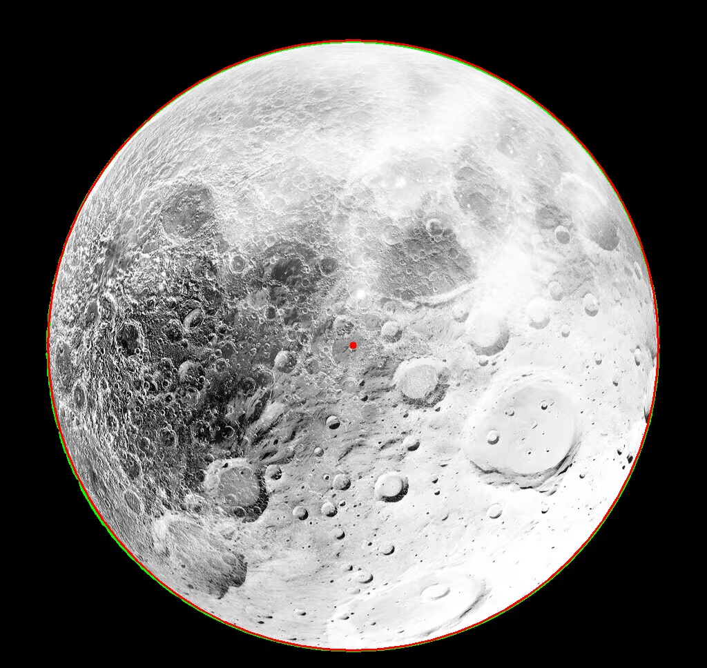
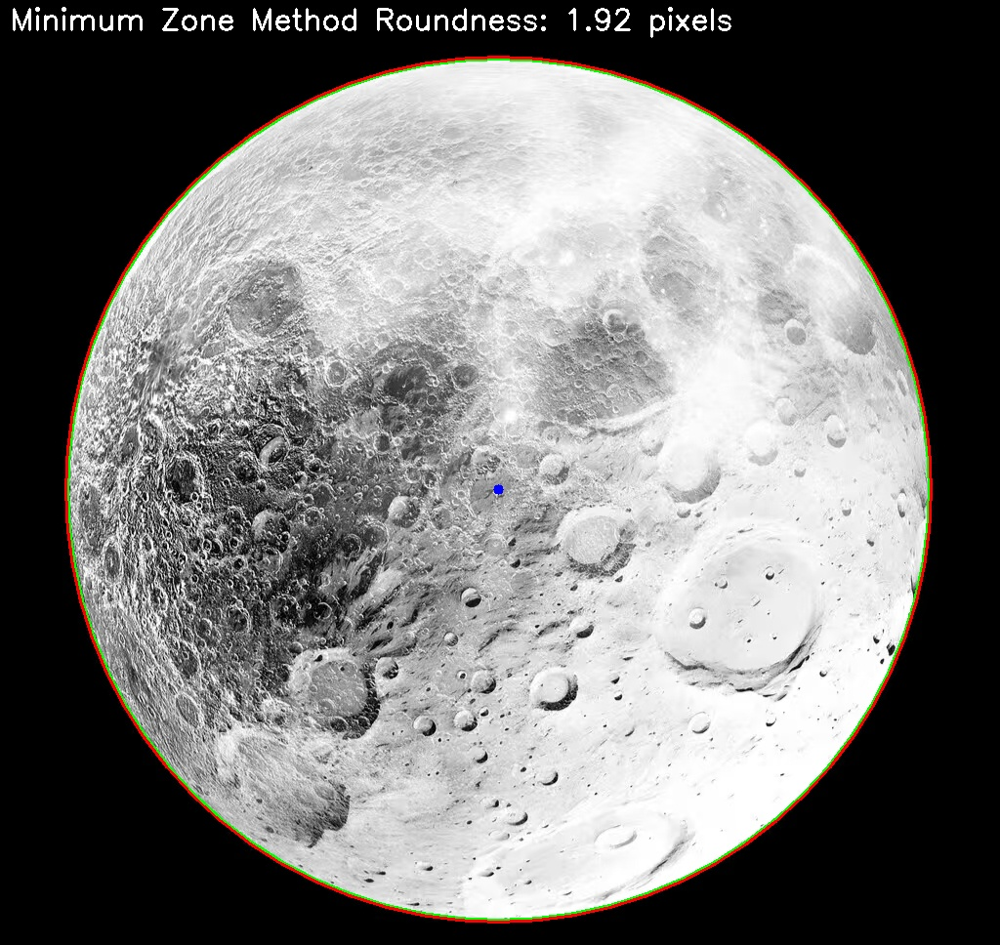
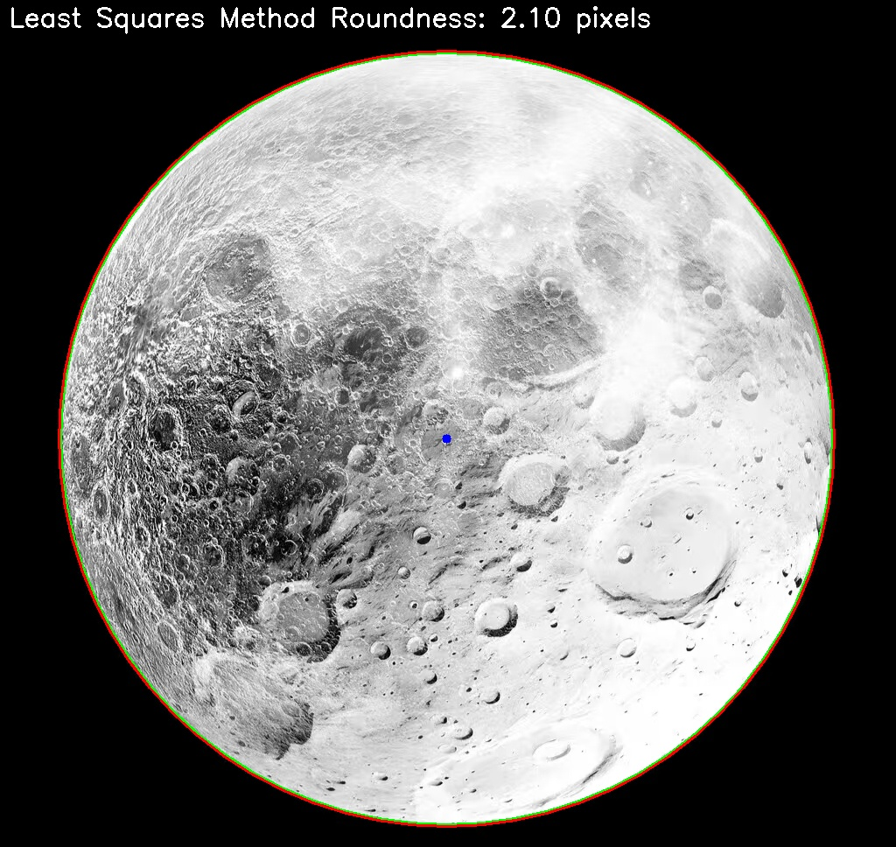
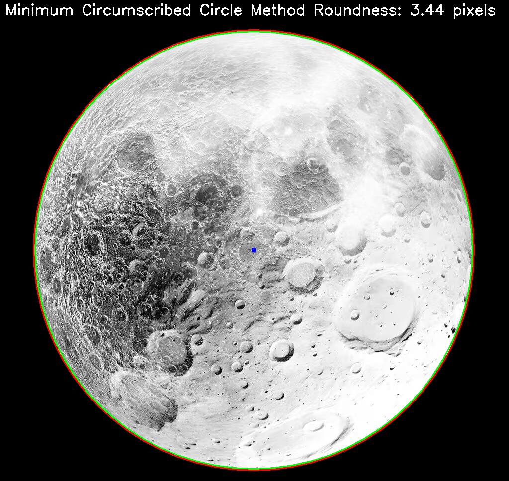
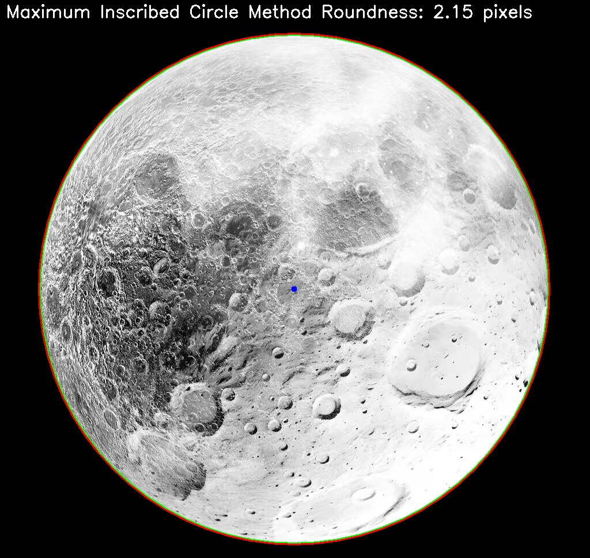

# Circle Detection and Roundness Calculation

This project implements algorithms to detect circles in product images and calculate their roundness tolerance.

## Project Structure
```
detection-circle/
├── dataset/            # Contains input images
├── examples/           # Example result images
├── src/                # Source code
│   ├── image_processor.py
│   ├── contour_processor.py
│   ├── circle_detector.py
│   ├── roundness_calculator.py
│   ├── visualizer.py
│   └── main.py
├── tests/              # Test cases
│   ├── test_image_processor.py
│   ├── test_contour_processor.py
│   ├── test_circle_detector.py
│   └── test_roundness_calculator.py
├── requirements.txt    # Dependencies
└── README.md           # Project documentation
```

## Installation

```bash
pip install -r requirements.txt
```

## Usage

### Processing a Single Image

```bash
python src/main.py --image_path dataset/9.jpg --method min_zone
```

### Processing All Images in a Directory

```bash
python src/main.py --image_path dataset --method min_zone
```

### Available Methods for Roundness Calculation

- `min_zone`: Minimum Zone Method - Finds two concentric circles with minimum radial difference that contain all points
- `least_squares`: Least Squares Circle Method - Finds a circle that minimizes the sum of squares of distances from points to the circle
- `min_circumscribed`: Minimum Circumscribed Circle Method - For external circles, finds the smallest circle that contains all points
- `max_inscribed`: Maximum Inscribed Circle Method - For internal circles, finds the largest circle that is contained by all points

### Output

The program generates output files in the `output` directory. For each processed image, it creates a subdirectory containing:

- `edges.jpg`: Edge detection result
- `contours.jpg`: Contour detection result
- `circles.jpg`: Circle detection result
- `result_X_method.jpg`: Roundness calculation result for each detected circle using the specified method

## Features

1. Extract product contours from images
2. Implement contour single-line processing
3. Implement geometric description of the single-line contours
4. Calculate roundness tolerance using various methods

## Result Examples

### Edge Detection


### Contour Detection


### Circle Detection


### Roundness Calculation

#### Minimum Zone Method


#### Least Squares Method


#### Minimum Circumscribed Circle Method


#### Maximum Inscribed Circle Method

